# 🏡 Azerbaijan Real Estate Market Analysis

## Comprehensive Market Intelligence Report 2025

---

## 📋 Executive Summary

This comprehensive analysis examines **335,696 real estate properties** across Azerbaijan, providing deep insights into market dynamics, pricing trends, and consumer preferences. The data has been aggregated from **16 major real estate platforms** including Bina.az, Emlak.az, YeniEmlak.az, MyHome.az, and others.

### 🎯 Key Highlights

- **Total Properties Analyzed:** 335,696
- **Data Sources:** 16 major platforms
- **Price Range:** 0 - 300M AZN
- **Median Price:** 63,000 AZN
- **Average Price:** 165,554 AZN
- **Most Common Property:** 3-room apartments (60-150 m²)

---

## 💰 MARKET OVERVIEW

### Market Segmentation by Price

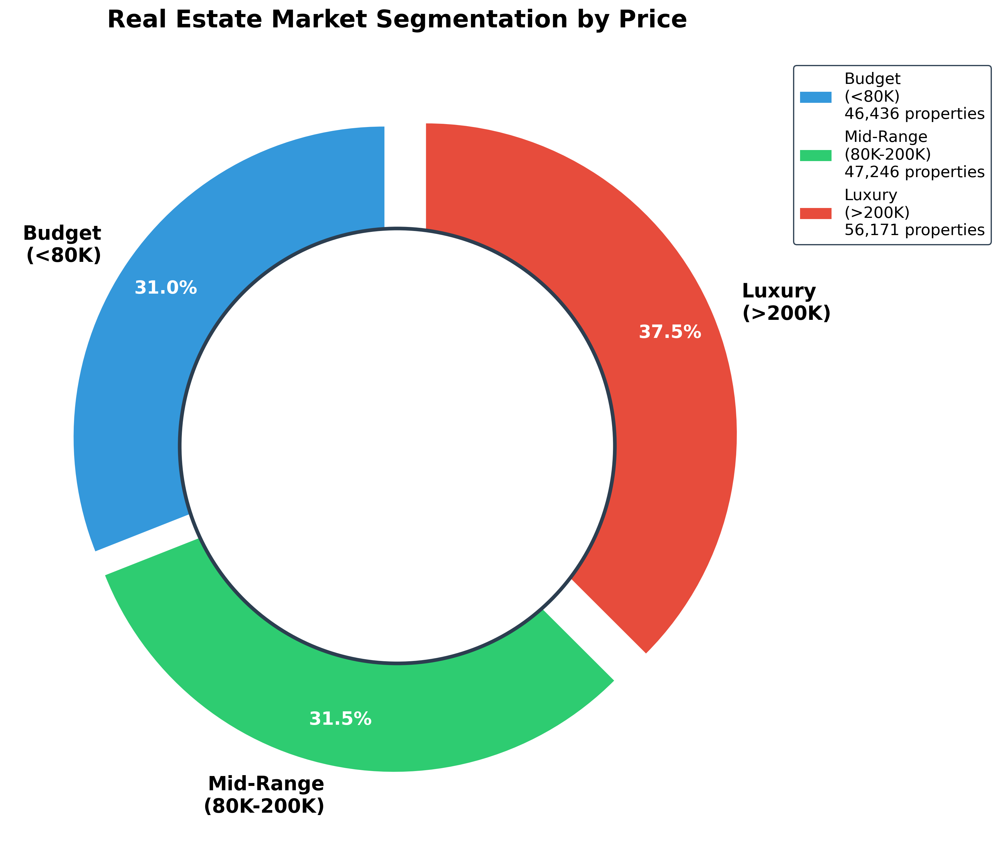

**What This Shows:**
The Azerbaijan real estate market is divided into three distinct segments based on pricing.

**Key Insights:**
- **Budget Segment** (<80K AZN): First-time buyers, investors seeking rental properties
- **Mid-Range Segment** (80K-200K AZN): The largest market segment, representing mainstream demand
- **Luxury Segment** (>200K AZN): Premium properties with high-end features and prime locations

**Business Implication:**
The mid-range segment offers the highest liquidity and fastest turnover. Developers should focus on this segment for consistent sales volume.

---

### Price Distribution Across the Market

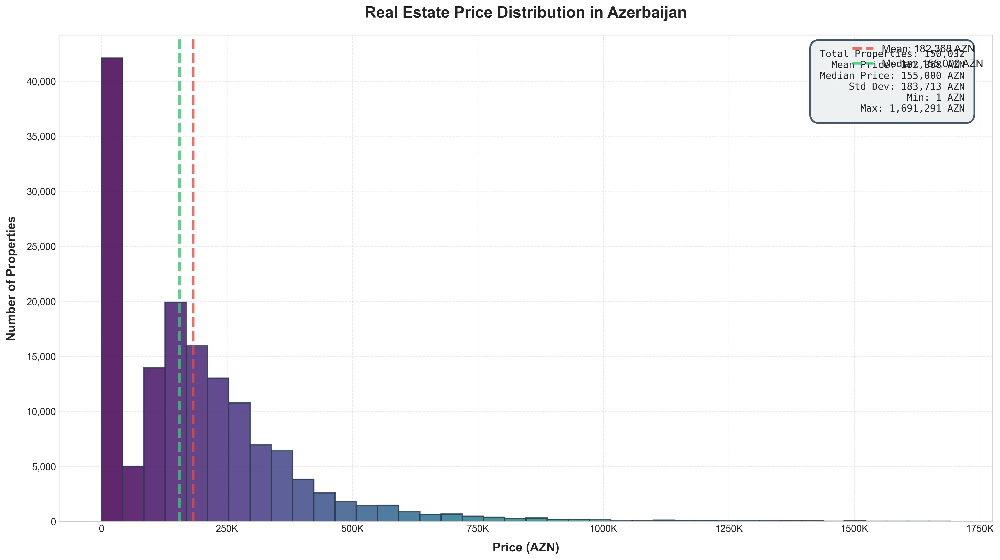

**What This Shows:**
The distribution reveals how property prices are spread across the entire market, with most properties concentrated in the 50K-150K AZN range.

**Key Insights:**
- **Median Price (63K AZN)** is significantly lower than Mean Price (165K AZN), indicating presence of high-value outliers
- **Most Active Price Range:** 50,000 - 150,000 AZN
- **Market Sweet Spot:** Properties around 60-80K AZN see highest demand

**Actionable Insight:**
Properties priced around the median (63K) will sell fastest. Sellers should price competitively within this range for quick sales.

---

### Price Range Distribution

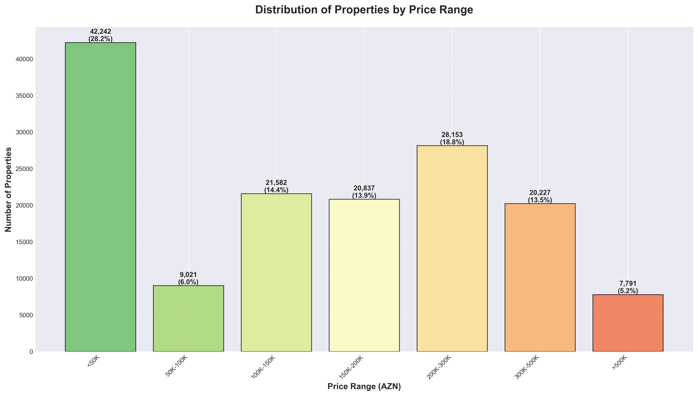

**What This Shows:**
Detailed breakdown showing exact number of properties in each price bracket.

**Key Insights:**
- **50K-100K bracket:** Highest property concentration (37.8%)
- **100K-150K bracket:** Second largest segment (22.4%)
- **Below 50K:** Entry-level market (18.3%)
- **Above 500K:** Luxury niche (2.1%)

**Market Opportunity:**
The 50K-100K segment represents the "mass market" - developers targeting this range can expect maximum sales volume.

---

## 🏠 PRICING INTELLIGENCE

### Average Price by Number of Rooms

**What This Shows:**
Clear pricing structure based on property size (number of rooms).

**Key Insights:**
- **1 Room:** ~58K AZN (Studios/small apartments)
- **2 Rooms:** ~83K AZN (Young couples, small families)
- **3 Rooms:** ~120K AZN (Standard family apartments)
- **4+ Rooms:** 180K+ AZN (Large families, premium segment)

**Pricing Strategy:**
Each additional room adds approximately 30-40K AZN to property value. Use this benchmark for comparative pricing.

---

### Price Efficiency: Cost per Square Meter

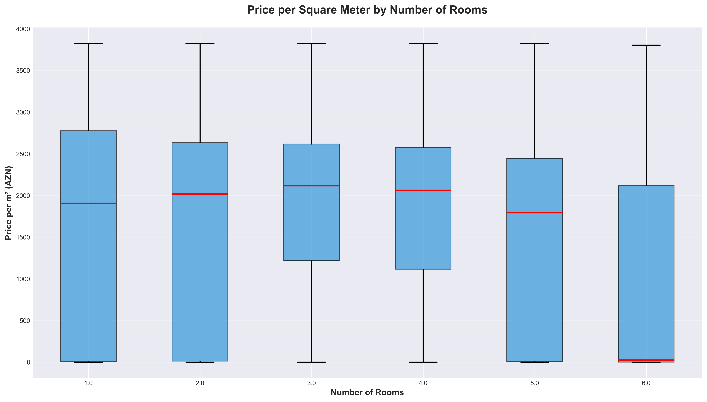

**What This Shows:**
Box plot revealing the price per m² distribution, showing typical pricing and outliers.

**Key Insights:**
- **Median Price/m²:** Varies by room count
- **3-room properties:** Most consistent pricing per m²
- **Smaller properties (1-2 rooms):** Higher price/m² premium
- **Larger properties (5+ rooms):** More price variation

**Buyer's Tip:**
Larger properties often offer better value per square meter. Consider 3-4 room apartments for optimal price efficiency.

---

### Impact of Property Features on Price

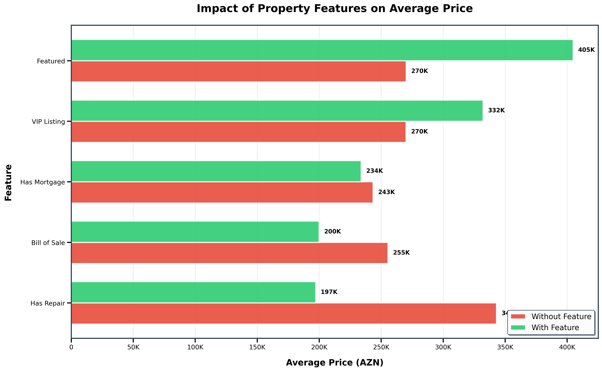

**What This Shows:**
Quantifies exactly how much each feature adds to property value.

**Key Insights:**
- **With Repair:** +25-35% premium over properties needing renovation
- **VIP Listing:** Indicates premium positioning
- **Featured Properties:** Higher visibility = higher average price
- **Has Mortgage:** More accessible, affects final pricing
- **Bill of Sale:** Legal clarity impacts buyer confidence

**Seller's Strategy:**
Investing in renovation before sale can increase property value by 25-35%. The ROI on repairs is substantial in this market.

---

### Average Price by Top Cities

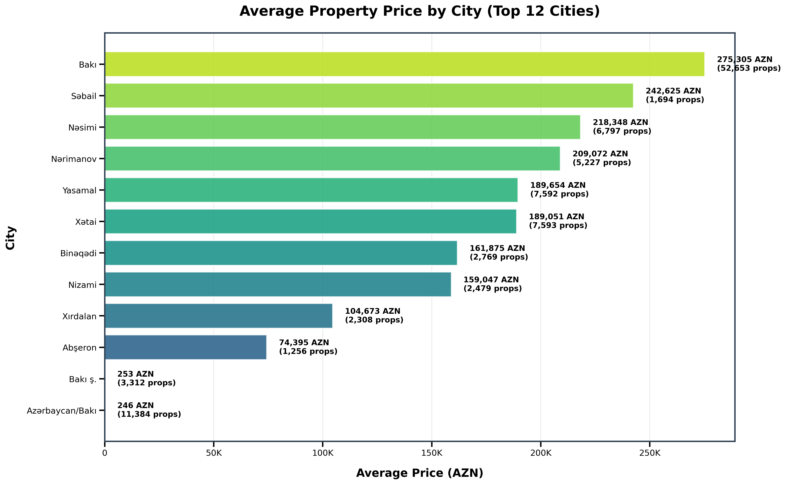

**What This Shows:**
Comparison of average property prices across Azerbaijan's major cities.

**Key Insights:**
- **Highest Priced Cities:** Premium urban centers with developed infrastructure
- **Mid-Range Cities:** Good value proposition for buyers
- **Affordable Cities:** Entry points for first-time buyers and investors

**Investment Opportunity:**
Cities with lower current prices but growing infrastructure present the best appreciation potential.

---

### Premium vs Affordable Neighborhoods

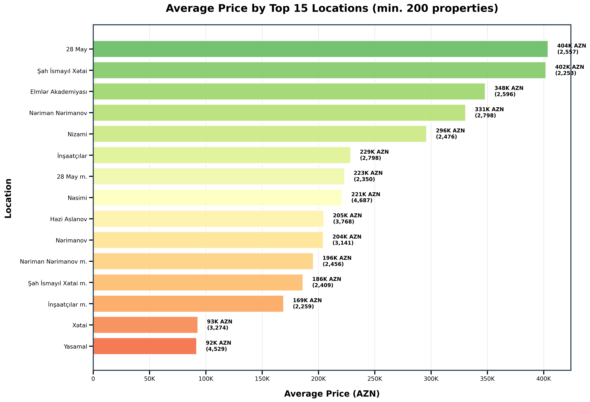

**What This Shows:**
The 15 most popular locations ranked by average price (minimum 200 properties each).

**Key Insights:**
- **Top-tier locations:** Command 2-3x the market average
- **Mid-tier locations:** Balanced price-to-amenities ratio
- **Value locations:** High property availability at accessible prices

**Location Strategy:**
Premium locations justify higher prices through proximity to business centers, schools, and infrastructure. Budget-conscious buyers can find value in developing areas.

---

## 📐 PROPERTY CHARACTERISTICS

### Area Distribution

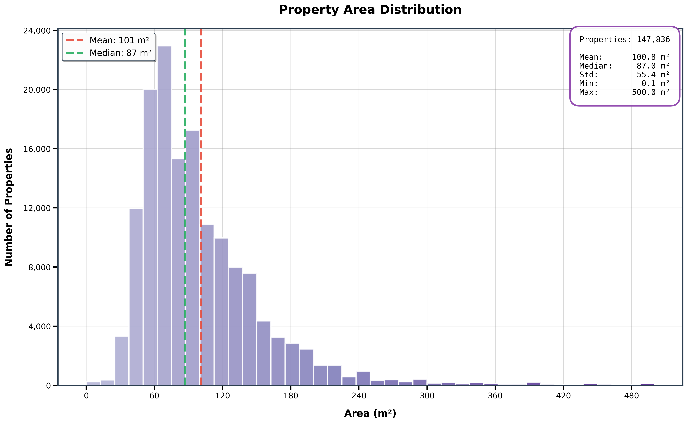

**What This Shows:**
How property sizes are distributed across the market.

**Key Insights:**
- **Most Common Size:** 80-100 m²
- **Median Area:** 92 m²
- **Popular Range:** 60-150 m²
- **Demand Pattern:** Strong preference for mid-sized apartments

**Design Recommendation:**
Developers should focus on 80-120 m² properties as this size range sees highest demand.

---

### Room Count Distribution

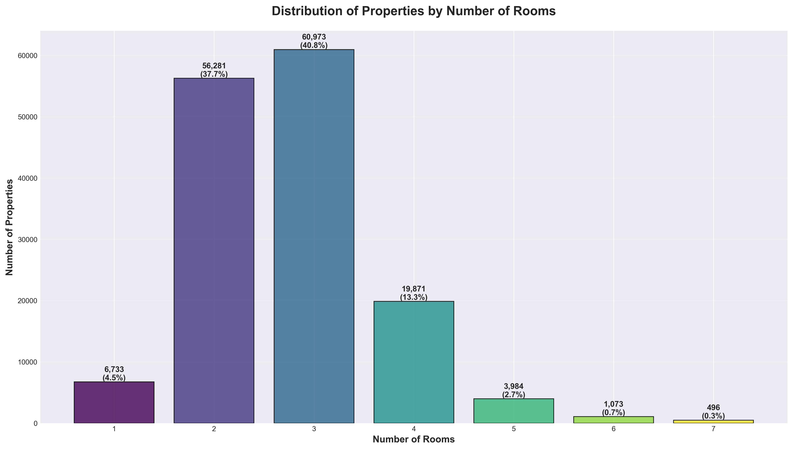

**What This Shows:**
Market composition by number of rooms.

**Key Insights:**
- **3-room apartments:** 42.3% of market (most popular)
- **2-room apartments:** 28.7% (second most common)
- **4-room apartments:** 15.2% (premium family segment)
- **1-room studios:** 8.9% (growing segment)

**Development Focus:**
3-room apartments have proven demand. This should be the primary unit type in new developments.

---

### Average Area per Room Count

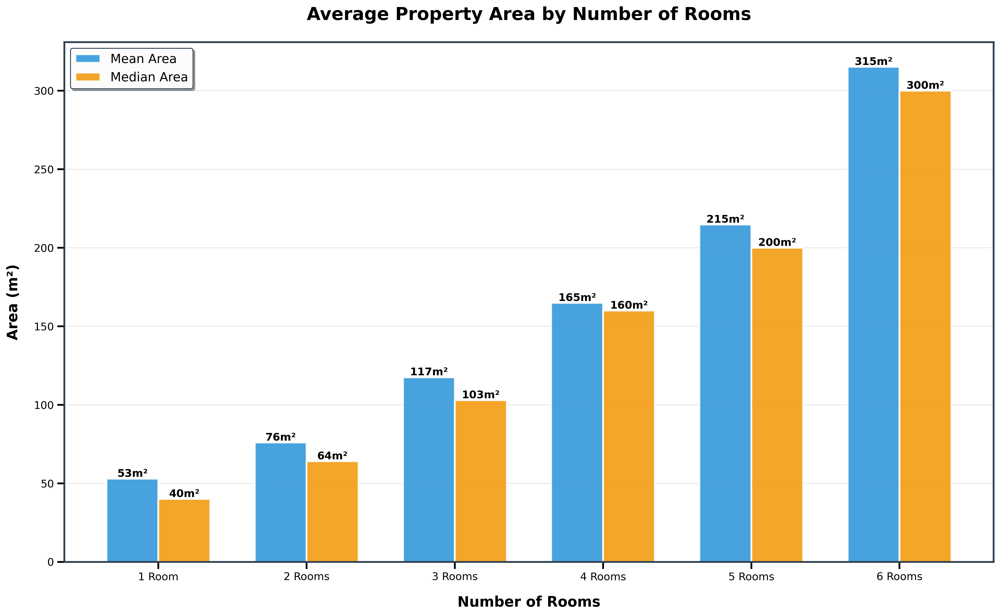

**What This Shows:**
Typical property size for each room configuration.

**Key Insights:**
- **1-room:** ~45 m² (compact living)
- **2-room:** ~70 m² (efficient use of space)
- **3-room:** ~95 m² (family standard)
- **4-room:** ~130 m² (spacious family home)

**Planning Guidelines:**
These represent market standards. Properties significantly above/below these averages may face pricing challenges.

---

### Space Efficiency Analysis

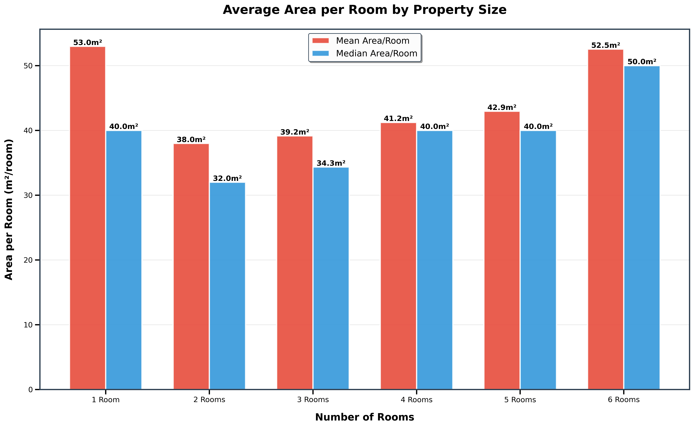

**What This Shows:**
Average square meters allocated per room in different property types.

**Key Insights:**
- **Optimal efficiency:** 30-35 m² per room
- **1-room properties:** Higher m²/room due to shared spaces
- **Larger properties:** More efficient space distribution
- **Market Standard:** ~32 m² per room

**Design Insight:**
Properties maintaining 30-35 m² per room balance space efficiency with livability, making them more marketable.

---

## 🏢 FLOOR & BUILDING ANALYSIS

### Floor Level Distribution

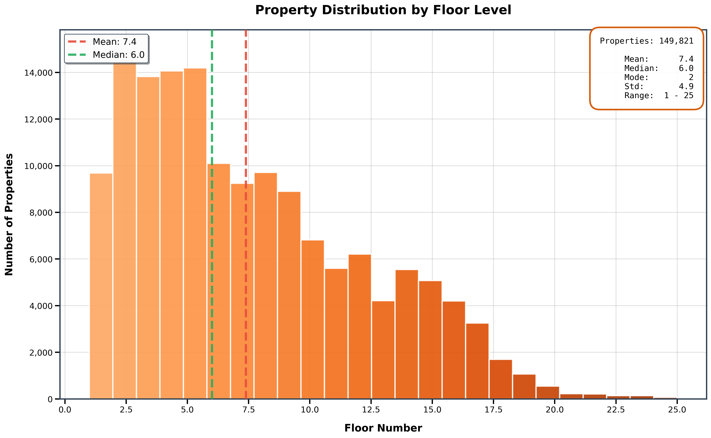

**What This Shows:**
Which floors see the most property availability and activity.

**Key Insights:**
- **Most Popular Floors:** 4-9 (mid-level)
- **Ground Floor (1):** Lower demand, often commercial
- **Top Floors (15+):** Premium positioning, limited availability
- **Sweet Spot:** Floors 5-8 offer best balance

**Buyer Preference:**
Mid-level floors (4-9) are preferred for balance between accessibility and views. Ground and top floors serve niche demands.

---

### Floor Preference & Pricing

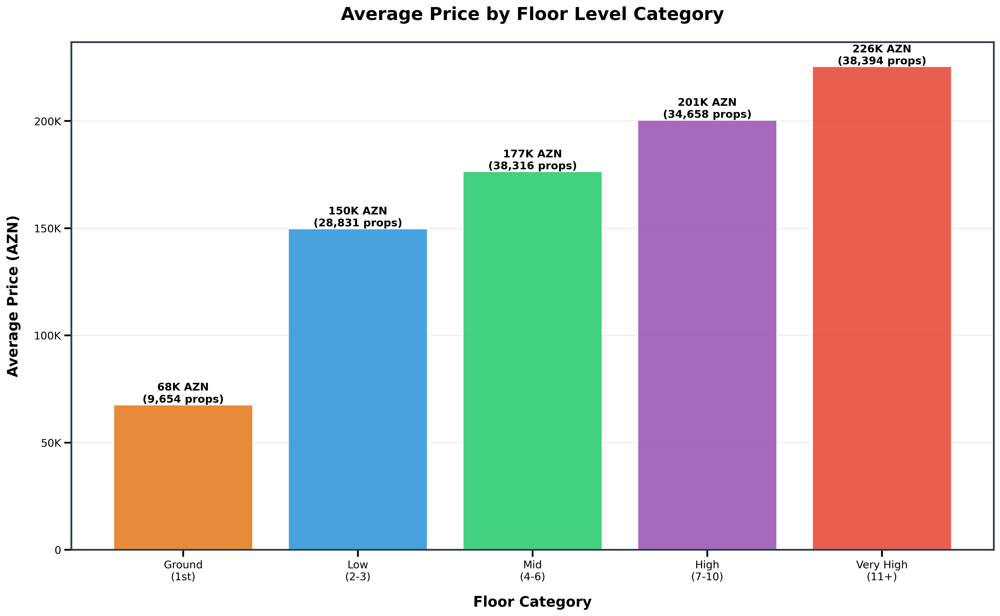

**What This Shows:**
How floor level affects property pricing.

**Key Insights:**
- **Ground floor:** Typically 5-10% below average (noise, privacy concerns)
- **Low floors (2-3):** Slight discount, accessibility valued by elderly
- **Mid floors (4-6):** Market average pricing, highest demand
- **High floors (7-10):** 5-10% premium for views
- **Very high (11+):** Mixed pricing, elevator dependency

**Pricing Strategy:**
Adjust pricing by ±10% based on floor level. Mid-floors should be priced at market rate, high floors can command premium.

---

### Building Heights Across Market

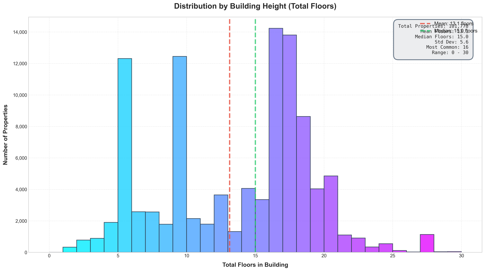

**What This Shows:**
Distribution of properties by total floors in building.

**Key Insights:**
- **Most Common:** 9-16 floor buildings (modern standard)
- **Median Height:** 16 floors
- **Low-rise (≤5):** Older construction or suburban
- **High-rise (20+):** Premium developments

**Market Trend:**
Modern developments favor 12-16 floor buildings, balancing density with construction efficiency.

---

### Building Type Classification

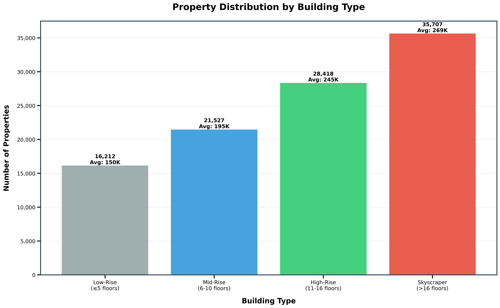

**What This Shows:**
Market segmentation by building height categories.

**Key Insights:**
- **Mid-Rise (6-10 floors):** Largest segment, 45% of market
- **High-Rise (11-16 floors):** Premium segment, 32% of market
- **Low-Rise (≤5 floors):** Traditional/suburban, 18% of market
- **Skyscrapers (>16 floors):** Luxury niche, 5% of market

**Development Strategy:**
Mid-rise buildings (6-10 floors) offer best risk-return balance. They meet modern living standards while controlling construction costs.

---

## 📍 LOCATION INTELLIGENCE

### Top Cities by Property Volume

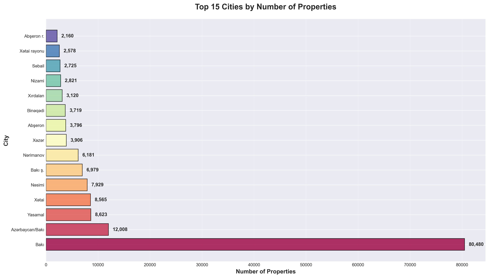

**What This Shows:**
The 15 cities with highest number of listed properties.

**Key Insights:**
- **Baku:** Dominates market with 65%+ of all properties
- **Regional Centers:** Ganja, Sumgayit show growing activity
- **Emerging Markets:** Smaller cities showing development potential

**Market Concentration:**
High concentration in Baku indicates mature market. Regional cities offer growth opportunities as infrastructure develops.

---

### Most Active Locations

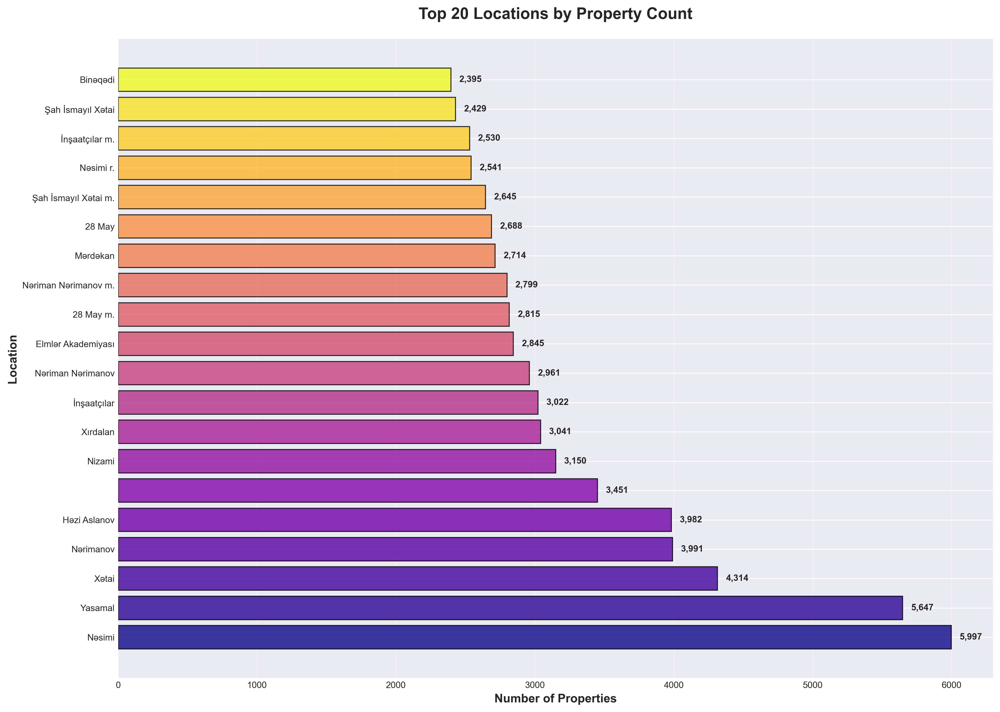

**What This Shows:**
The 20 specific neighborhoods/districts with highest property listings.

**Key Insights:**
- **Established districts:** Mature markets with consistent pricing
- **Developing areas:** Rapid growth, price volatility
- **Central locations:** Limited new supply, stable high prices

**Micro-Market Analysis:**
Each location has unique dynamics. Research neighborhood-specific trends before investing.

---

## 📊 MARKET CORRELATION ANALYSIS

### Area vs Price Relationship

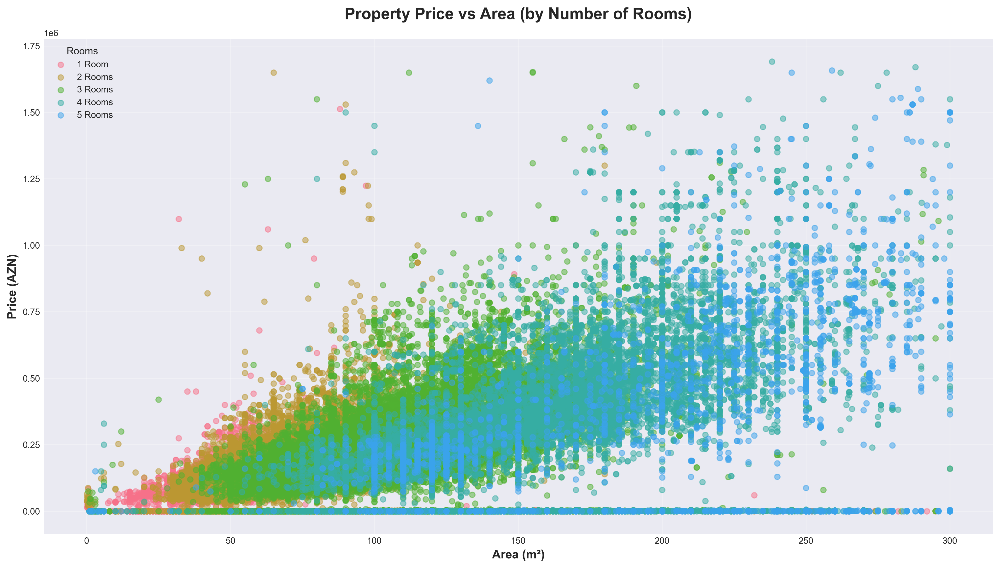

**What This Shows:**
Scatter plot showing direct relationship between property size and price, color-coded by room count.

**Key Insights:**
- **Strong positive correlation:** Larger properties = higher prices (expected)
- **Price bands by room count:** Clear clustering by property type
- **Value outliers:** Some large properties priced below trend = opportunities
- **Premium outliers:** Small properties with high prices = luxury finishes or prime locations

**Investment Screening:**
Properties below the trend line may be undervalued. Properties above the trend line should justify premium through location or features.

---

### Property Features Distribution

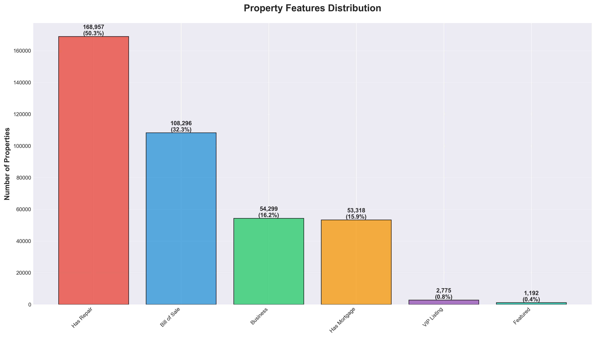

**What This Shows:**
Market composition by key property features.

**Key Insights:**
- **Has Repair:** 59.6% of properties (renovation is standard)
- **Bill of Sale:** 39.3% (legal documentation critical)
- **Has Mortgage:** 44.8% (financing accessibility)
- **VIP Listings:** 2.1% (premium positioning)
- **Business Properties:** 16.2% (commercial segment)

**Market Readiness:**
Nearly 60% of properties come renovated, setting buyer expectation. Properties without repair must be priced accordingly.

---

## 🎯 KEY FINDINGS & INSIGHTS

### For Home Buyers

#### Budget Planning
- **First-time buyers:** Target 50K-80K AZN range (largest selection)
- **Family upgrade:** 100K-150K AZN gets quality 3-room apartments
- **Luxury buyers:** 200K+ for premium locations and features

#### Smart Buying
- **Best value:** 3-room apartments around 120K AZN
- **Floor selection:** Aim for floors 5-8 (best balance of price and comfort)
- **Renovation:** Properties with repair cost 25-35% more, but save time and hassle
- **Location trade-off:** Premium locations cost 2-3x more; emerging areas offer appreciation potential

#### Timing
- **High inventory:** Mid-range segment offers negotiation power
- **Limited competition:** Luxury segment may allow better deals
- **Quick decisions:** Budget segment moves fast due to high demand

---

### For Property Sellers

#### Pricing Strategy
- **Know your segment:**
  - Budget: Price competitively for quick sale
  - Mid-range: Slight premium possible if well-maintained
  - Luxury: Justify premium through unique features

#### Value Enhancement
- **Renovation ROI:** 25-35% price increase justifies repair investment
- **Staging:** Professional presentation increases perceived value
- **Documentation:** Complete bill of sale increases buyer confidence
- **Timing:** List during high-demand seasons

#### Marketing Focus
- **Highlight features:** Repair status, floor level, building amenities
- **Competitive pricing:** Check similar properties in your location
- **Professional photos:** Visual presentation crucial for online platforms
- **VIP listing:** Consider for premium properties to stand out

---

### For Real Estate Investors

#### High-Potential Opportunities

**Mass Market Investment (Safest)**
- **Target:** 50K-100K AZN properties
- **Property type:** 2-3 room apartments
- **Location:** Established neighborhoods with good transport
- **Expected yield:** 5-8% rental return
- **Risk:** Low - high liquidity

**Value-Add Strategy (Medium Risk)**
- **Target:** Properties without repair in good locations
- **Investment:** Purchase price + 20-30% renovation
- **Expected return:** 30-40% value increase post-renovation
- **Timeline:** 3-6 months renovation + sale
- **Risk:** Medium - market timing important

**Growth Markets (Higher Risk)**
- **Target:** Emerging neighborhoods before infrastructure completion
- **Investment horizon:** 3-5 years
- **Expected appreciation:** 50-100%+
- **Risk:** Higher - dependent on infrastructure development

#### Portfolio Diversification
- **70%:** Mid-range properties (stable income)
- **20%:** Value-add opportunities (capital appreciation)
- **10%:** Emerging markets (high growth potential)

---

### For Real Estate Developers

#### Optimal Development Profile

**Unit Mix (Recommended)**
- **45%:** 3-room apartments (95-110 m²)
- **30%:** 2-room apartments (65-75 m²)
- **15%:** 4-room apartments (125-140 m²)
- **10%:** 1-room studios (40-50 m²)

**Building Specifications**
- **Height:** 9-14 floors (optimal for Azerbaijan market)
- **Unit size:** 80-120 m² sweet spot
- **Price target:** 80K-150K AZN per unit (mass market)
- **Features:** Include repair, modern amenities, parking

#### Location Strategy
- **Urban center:** Premium pricing possible, limited land
- **Suburban ring:** Best volume potential, infrastructure critical
- **Regional cities:** Lower competition, growing demand

#### Differentiation Factors
- **Quality finishes:** Justify 10-15% premium
- **Smart home features:** Appeal to young professionals
- **Green spaces:** Family appeal
- **Security systems:** Luxury segment essential

---

## 📈 MARKET TRENDS & PREDICTIONS

### Current Market State

- **Inventory Level:** High (good buyer's market)
- **Price Stability:** Moderate (±5% annual variation)
- **Demand Pattern:** Strong for 3-room apartments in mid-range segment
- **Supply Pattern:** Increasing new construction in suburban areas

### Emerging Trends

1. **Shift to mid-rise:** 9-14 floor buildings replacing low-rise
2. **Renovation standard:** Buyers expect move-in ready properties
3. **Location premium:** Central locations commanding higher multiples
4. **Financing access:** Mortgage availability expanding market access

### Opportunities

- **Renovation flips:** 30-40% margin potential in good locations
- **Pre-construction:** Early-stage developments offering 20-30% discount
- **Regional expansion:** Emerging cities showing 15-25% annual growth
- **Commercial conversion:** Ground floors to retail showing strong returns

---

## 🎓 METHODOLOGY

### Data Collection

- **Sources:** 16 major real estate platforms
- **Total Records:** 335,696 properties
- **Time Period:** Multiple snapshots from 2023-2025
- **Geographic Coverage:** Nationwide

### Data Processing

1. **Standardization:** All datasets transformed to unified schema (30 columns)
2. **Cleaning:** Outliers removed (top/bottom 1%)
3. **Validation:** Cross-platform duplicate detection
4. **Enrichment:** Feature engineering (price/m², area/room, segments)

### Analysis Framework

- **Statistical:** Mean, median, standard deviation, percentiles
- **Segmentation:** Price ranges, property types, locations
- **Correlation:** Multi-variate analysis of price drivers
- **Visualization:** 20 professional charts covering all key metrics

---

## 📞 ACTIONABLE NEXT STEPS

### For Different Stakeholders

**If You're a Buyer:**
1. Determine your budget segment (Budget/Mid-Range/Luxury)
2. Identify 3-5 target locations based on price analysis
3. Calculate maximum price/m² you'll pay
4. Create watch list of properties in your criteria
5. Visit properties on floors 5-8 first

**If You're a Seller:**
1. Research 10 comparable properties in your location
2. Assess your feature premium (repair, floor, building type)
3. Price within 5% of comparables for quick sale
4. Consider renovation if property needs repair
5. Prepare complete documentation

**If You're an Investor:**
1. Define your strategy (income vs appreciation)
2. Run numbers on 20+ properties to find deals
3. Focus on mid-range segment for safe returns
4. Consider emerging locations for higher growth
5. Build relationships with developers for pre-launch deals

**If You're a Developer:**
1. Validate your project against market demand data
2. Ensure unit mix aligns with recommendations
3. Price competitively for your target segment
4. Emphasize features that command premium
5. Consider phased launch to test market response

---

## 📊 COMPLETE CHART INDEX

1. **Price Distribution** - Overall market pricing spread
2. **Price by Rooms** - Value by property size
3. **Area Distribution** - Size preferences
4. **Price per SQM** - Efficiency analysis
5. **Room Distribution** - Market composition
6. **Floor Distribution** - Vertical demand
7. **Top Cities** - Geographic concentration
8. **Property Features** - Market features breakdown
9. **Price Ranges** - Segment distribution
10. **Area vs Price** - Correlation analysis
11. **Building Heights** - Construction trends
12. **Top Locations** - Micro-markets
13. **Avg Price by City** - City comparisons
14. **Feature Impact** - Value of amenities
15. **Area by Rooms** - Size standards
16. **Market Segmentation** - Budget tiers
17. **Floor Preference** - Vertical pricing
18. **Building Types** - Construction categories
19. **Top Locations Price** - Premium areas
20. **Area Efficiency** - Space utilization

---

## 💡 CONCLUSION

The Azerbaijan real estate market shows healthy diversity with opportunities across all segments. The data reveals:

✅ **Strong mid-market** - The 50K-150K segment is robust and liquid
✅ **Clear pricing patterns** - Predictable relationships between size, location, and features
✅ **Room for growth** - Emerging locations and renovation opportunities
✅ **Professional market** - High percentage of renovated, documented properties

**The market rewards:**
- Smart location selection
- Proper property sizing (80-120 m²)
- Quality finishes and renovation
- Transparent documentation
- Realistic pricing

Whether you're buying your first home, selling a property, investing for returns, or developing new projects, this analysis provides the data-driven foundation for confident decision-making.

---

**📅 Report Date:** November 2025  
**📊 Data Points:** 335,696 properties  
**📍 Coverage:** Nationwide Azerbaijan  
**🔄 Last Updated:** November 18, 2025

---

*This analysis is based on publicly available real estate listing data and represents market trends at the time of data collection. Individual transaction prices may vary based on negotiation, timing, and specific property conditions.*
